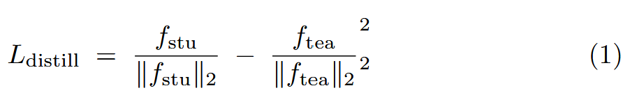
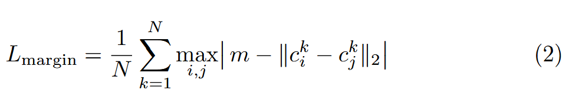
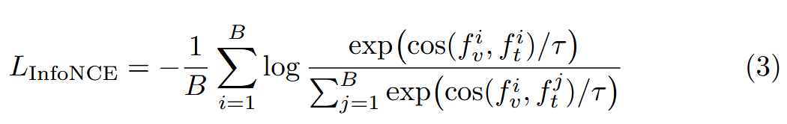

# MMTTA: Multimodality Test-Time Training Adaption

This repository implements **MMTTA**, our framework for **Multi-Modal Person Re-Identification**, extending multi-modality training by adapting the model at inference using relationships across RGB, IR, Thermal, and caption modalities.

---

## Features

- **Cross-Identity Inter-Modal Loss (CIM)**: Constrains distances between inter-modal features of different identities to enhance embedding discriminability.

- **Multi-Modal Adaptation**: Leverages unlabeled test samples across modalities for on-the-fly fine-tuning before inference.

- **Distillation L2 Loss**: Aligns student and teacher feature representations via normalized L2 distance:

  

  Implements distillation between ViT (student) and nomic (teacher) features.

- **Multi-Modal Margin Loss**: Enforces a margin between modality-specific identity centers by penalizing the worst-case pair. For modalities $i,j\in\{\mathrm{RGB},\mathrm{IR},\mathrm{TI}\}$ with centers $c_i, c_j$ and margin $m$:

  

  where $N$ is the number of identities in the batch.

- **Vision–Language InfoNCE Loss**: Aligns image and text features using a temperature-scaled InfoNCE objective. Given a batch of size $B$, visual features $f_v^i$ and text features $f_t^i$, and temperature $\tau$:

  

---


## Environment & Dependencies

1. Clone the repository and install dependencies:
   ```bash
   git clone <this-repo-url>
   cd <repo-folder>
   pip install -r requirements.txt
   ```
2. Based on prior works:
   - TransReID (ICCV 2021)
   - IEEE AAAI 2022 multi-modal ReID

---

## Datasets

Prepare each person ReID dataset with RGB, IR, Thermal, and caption modalities:

- **Market1501** (and Market1501-MM)
- **Real2**
- **PRCC**
- **CUHK03**
- **MSMT17**

Organize under `data/{DatasetName}`:

```
data/
  Market1501/
    RGB/
    IR/
    Thermal/
    captions.txt
  PRCC/
    ...
```

Adjust dataset paths in `configs/{DatasetName}/` as needed.

---

## Training

Standard multi-modal training:

```bash
# Example: train on Market1501
python train.py --config_file configs/Market1501/vit_base.yml
```

Available configs:

- `configs/Market1501-MM/vit_base.yml`
- `configs/Real2/vit_base.yml`
- `configs/PRCC/vit_base.yml`
- `configs/CUHK03/vit_base.yml`
- `configs/MSMT17/vit_base.yml`

---

## Evaluation

After training epochs, metrics (mAP, CMC) are logged. To evaluate a saved checkpoint:

```bash
python test.py --config_file configs/Market1501/vit_base.yml \
               --model_path /path/to/checkpoint.pth
```

---

*This README focuses on code usage, dataset setup, and loss function definitions.*

